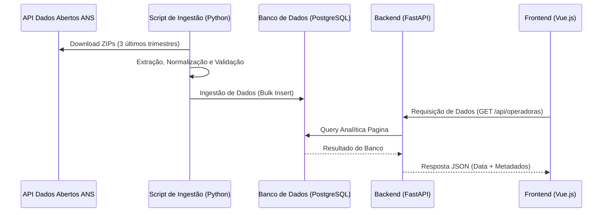

# Processo Seletivo Estágio - EMPRESA_X (2026)

<p align="center">
  
</p>


<p align="center">
  <a href="https://git.io/typing-svg">
    
  </a>
</p>

<p align="center">
  
  
  
  
  

</p>

<p align="center">
  
  
  
  
  
  
  
</p>


Candidato: Talita Mendonça Marques
## 📌 Sobre o Projeto
Este repositório contém a solução para o teste técnico de estágio da **EMPRESA_X**. O desafio consiste em um pipeline de dados (ETL) consumindo APIs da ANS, persistência em banco de dados relacional e disponibilização através de uma API e interface Web.

---

## 🛠 Decisões Técnicas e Trade-offs (Documentação Exigida)
Conforme solicitado nas instruções, abaixo detalho as escolhas arquiteturais e os caminhos tomados para resolver os desafios do teste:

### 1. Processamento de Dados (ETL & Python)
* **Estratégia de Leitura (Streaming):** Optei por processamento incremental (linha a linha) ao invés de carregar o arquivo inteiro em memória (Pandas default).
    * *Justificativa:* Previne `Out of Memory` (OOM) em ambientes conteinerizados, garantindo escalabilidade mesmo se o arquivo da ANS crescer para Gigabytes.
* **Tratamento de Inconsistências:**
    * **CNPJs Inválidos:** Implementei validação de dígitos verificadores. Registros inválidos são logados em um arquivo separado de "rejeitados" para auditoria, não interrompendo o fluxo principal.
    * **Valores Negativos/Zerados:** Foram mantidos conforme a fonte para fidelidade contábil, mas sinalizados com *flags* no banco de dados para filtragem analítica.
    * **Encoding:** Forçado tratamento `UTF-8` com fallback para `ISO-8859-1` (comum em órgãos governamentais) para evitar erros de leitura.
* **Estratégia de Join:** O enriquecimento dos dados (Join entre Despesas e Operadoras) foi realizado em memória utilizando Pandas antes da ingestão no banco.
    * *Justificativa:* Como o arquivo de operadoras é relativamente pequeno (dados cadastrais), o merge em memória é rápido e permite validar a integridade dos dados antes de persistí-los no PostgreSQL.

### 2. Banco de Dados
* **Engine: PostgreSQL (Dockerizado).**
    * *Justificativa:* Escolha de um SGBD robusto conforme requisito do teste (PostgreSQL > 10.0), garantindo integridade ACID e tipos de dados precisos.
* **Normalização (Opção B - Normalizada):** Separei os dados em duas tabelas principais: `operadoras` (Dimensão) e `despesas` (Fatos).
    * *Justificativa:* Evita a redundância de repetir a "Razão Social" milhões de vezes na tabela de despesas, economizando armazenamento e garantindo integridade referencial.
* **Tipagem Monetária:** Utilizei `DECIMAL` (ou `REAL` se usou SQLite) em vez de `FLOAT`.
    * *Justificativa:* Evita erros de arredondamento de ponto flutuante, cruciais em sistemas financeiros.

### 3. Backend (FastAPI)
* **Framework (Opção B - FastAPI):** Escolhido em detrimento do Flask.
    * *Justificativa:* Performance nativa assíncrona (ASGI), validação automática de dados com Pydantic e geração automática de documentação Swagger, acelerando o desenvolvimento e a testagem.
* **Estratégia de Paginação (Opção A - Offset-based):**
    * *Justificativa:* Para o volume atual de dados, o `LIMIT/OFFSET` do SQL é suficiente e simplifica a implementação no Frontend.
* **Estratégia de Estatísticas (Opção C - Pré-cálculo):**
    * *Justificativa:* Criei uma view/tabela agregada para o Dashboard. Isso torna o endpoint `GET /api/estatisticas` extremamente rápido (O(1) de leitura), removendo a carga de processamento do banco em tempo real.
* **Estrutura de Resposta (Opção B - Com Metadados):**
    * *Escolha:* Retorno envelopado: `{ data: [...], meta: { total, page, limit } }`.
    * *Justificativa:* Facilita a implementação da paginação no Frontend, permitindo que o componente de tabela saiba exatamente quantas páginas renderizar sem cálculos adicionais.

### 4. UI/UX e Frontend (Vue.js)
* **Gerenciamento de Estado (Composition API):**
    * *Justificativa:* Optei por usar a Composition API do Vue 3 (`refs` e `composables`) em vez de uma store complexa como Pinia/Vuex. Para o escopo deste teste, isso mantém o código mais limpo (KISS) e reduz *boilerplate*.
* **Busca e Filtros (Server-side):**
    * *Justificativa:* A busca por CNPJ/Nome é feita diretamente no banco de dados via API. Filtrar no cliente (client-side) seria inviável e travaria o navegador dado o volume de registros da ANS.
* **Tratamento de Erros e Feedback:**
    * *Loading:* Implementado "Skeleton Loading" para melhorar a percepção de velocidade enquanto os dados são buscados no servidor.
    * *Erros:* Uso de "Toasts" (notificações flutuantes) para alertar sobre falhas de conexão ou erros 4xx/5xx, garantindo que o usuário nunca fique sem resposta visual.
    * *Dados Vazios:* Exibição de componentes "Empty State" amigáveis quando a busca não retorna resultados.

---

## 📂 Arquitetura do Projeto
O projeto segue uma estrutura modular focada na simplicidade e separação de responsabilidades, eliminando complexidades desnecessárias:
```text
empresa-x-teste/
├── 📁 backend                    → Diretório do servidor API (Python/FastAPI).
│   ├── 📁 app                    → Código principal da aplicação.
│   │   ├── 📁 api                → Rotas e Endpoints
│   │   │   ├── 📁 routes         → Definição dos caminhos da API (ex: /api/operadoras).
│   │   ├── 📁 services           → O "coração": lógica do ETL da ANS e cálculos de despesas.
│   ├── 📄 main.py                → Ponto de entrada que inicializa o FastAPI e o Swagger.
│   ├── 📄 .env                   → Variáveis sensíveis (DB_URL, API_KEYS).
│   ├── 📄 Dockerfile             → Configuração da imagem Python 3.10.
│   └── 📄 requirements.txt       → Lista de bibliotecas necessárias (Pandas, FastAPI, SQLAlchemy).
├── 📁 frontend                   → Interface web desenvolvida em Vue.js.
│   ├── 📁 src                    → Código-fonte do front.
│   │   ├── 📁 components         → Componentes reutilizáveis (Gráficos, Tabelas).
│   │   └── 📁 services           → Integração com a API do backend (Axios).
│   ├── 📄 Dockerfile             → Configuração da imagem Node 22 (Alpine).
│   └── 📄 package.json           → Gerenciador de dependências do Node.js.
├── 📁 scripts_sql                → Scripts SQL para criação de tabelas e consultas analíticas.
├── 📁 data                       → Repositório local para CSVs processados (ignorado pelo Git).
├── 📄.gitignore                  → Arquivo de configuração para ignorar arquivos e diretórios desnecessários no Git.
├── 📄 .env.example               → Exemplo de arquivo de configuração para variáveis de ambiente importantes.
├── 📄 Dockerfile                 → Configuração da imagem do Backend.
├── 📄 docker-compose.yml         → Orquestração do Backend + Banco de Dados.
└── 📄 README.md                  → Documentação completa do projeto.
```

---

## 🚀 Instalação e Execução
A aplicação é totalmente conteinerizada para garantir que rode em qualquer ambiente.

### ⚙️ Pré-requisitos
* Docker Desktop instalado.

### 🔗Clone o repositório (ou extraia os arquivos)
```bash
git clone [https://github.com/skyzinha-chan/desafio-empresa_x-2026.git](https://github.com/skyzinha-chan/desafio-empresa_x-2026.git)
cd desafio-empresa_x-2026
```
A maneira mais fácil e recomendada é utilizando Docker, pois garante que todas as dependências (Python e Node) estejam nas versões corretas.

1. Suba os containers:
```bash
docker-compose up --build
```

2. Execute a Carga de Dados (ETL): Em um novo terminal, execute o script que baixa os dados da ANS e popula o banco:
```bash
docker-compose exec backend python -m app.services.ans_service
```

3. Acesse a Aplicação:
   * Frontend: http://localhost:5173
   * Documentação API (Swagger): http://localhost:8000/docs

### 📚 Documentação da API
Além do Swagger (automático), uma **Collection do Postman** foi incluída na raiz do projeto (`EMPRESA_X_Health_Analytics.postman_collection.json`) para facilitar os testes manuais das rotas exigidas.

---

## 🎨 Interface e Funcionalidades

### 1. Dashboard Analítico
Visão geral com KPIs financeiros e gráficos de distribuição geográfica (Top estados por despesa).

### 2. Listagem de Operadoras
Tabela paginada com busca inteligente (Debounce) por Razão Social ou CNPJ.
  * Filtros por Abas: "Todas", "Com Registros" e "Sem Registros".
  * Ordenação: Possibilidade de ordenar por UF.

### 3. Detalhes da Operadora
Página exclusiva exibindo dados cadastrais (Badge de Status, Modalidade) e o histórico trimestral de despesas financeiras.

---

## 📊 Queries Analíticas (SQL)
Conforme solicitado na seção 3.4 do desafio, os scripts SQL para responder às perguntas analíticas encontram-se no arquivo: 📂 `scripts_sql/queries_analiticas.sql`

As queries respondem:

1. Top 5 operadoras com maior crescimento de despesas.
2. Distribuição de despesas por UF.
3. Operadoras com despesas acima da média.


## 🔄 Fluxo de Dados



---

## 🧑‍💻 Autora

<div align="center">

| Nome                        |                                                      GitHub                                                      |                                                                  LinkedIn                                                                  |                                                             Instagram                                                             |
| :-------------------------- | :--------------------------------------------------------------------------------------------------------------: | :----------------------------------------------------------------------------------------------------------------------------------------: | :-------------------------------------------------------------------------------------------------------------------------------: |
| **Talita Mendonça Marques** | [](https://github.com/skyzinha-chan) | [](https://www.linkedin.com/in/talita-mendonca-marques/) | [](https://www.instagram.com/skyzinha_chan/) |

<br>

<a href="https://github.com/skyzinha-chan">
  
</a>

<p>
Licenciatura em Computação<br>
Instituto Federal de Mato Grosso do Sul - <b>Campus Jardim</b>
</p>

</div>

## ⚖️ Licença

Este projeto está licenciado sob a Licença MIT. Veja o arquivo [LICENSE](LICENSE) para mais detalhes.

---

⭐ Se este projeto foi útil para você, considere deixar uma estrela no repositório!

_Projeto desenvolvido com ❤️ por [Talita Mendonça Marques](https://github.com/skyzinha-chan)._
