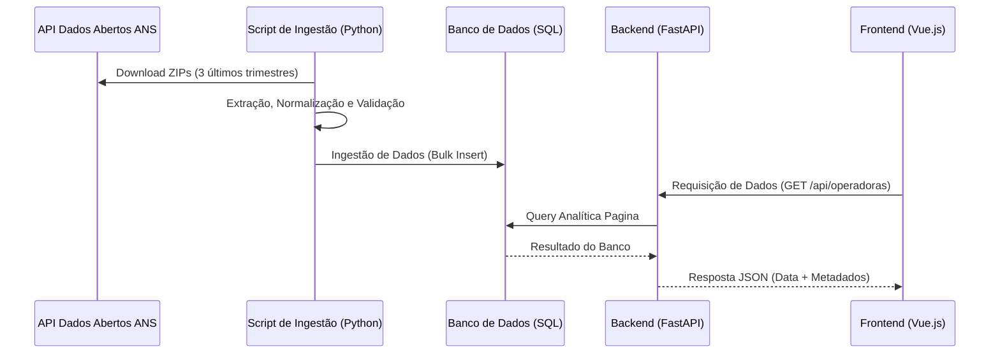

# Processo Seletivo Estágio - EMPRESA_X (2026)

<p align="center">
  
</p>


<p align="center">
  <a href="https://git.io/typing-svg">
    
  </a>
</p>

<p align="center">
  
  
  
  
</p>

<p align="center">
  
  
  
  
  
  
  
</p>


Candidato: Talita Mendonça Marques
## 📌 Sobre o Projeto
Este repositório contém a solução para o teste técnico de estágio da **EMPRESA_X**. O desafio consiste em um pipeline de dados (ETL) consumindo APIs da ANS, persistência em banco de dados relacional e disponibilização através de uma API e interface Web.

---

## 🛠 Decisões Técnicas e Trade-offs
Abaixo estão detalhadas as escolhas realizadas durante o desenvolvimento, conforme solicitado nas instruções do teste:

### 1. Processamento de Dados (ETL)
* **Processamento Incremental:** Optei por leitura e processamento em streaming (linha a linha) dos arquivos CSV da ANS. Isso previne estouro de memória (OOM), independentemente do tamanho do arquivo.
* **Filtragem Estrita:** A lógica de captura de despesas utiliza correspondência exata da conta contábil (`411`) para garantir a integridade financeira, evitando subcontas não solicitadas.

### 2. Banco de Dados
* **Arquitetura SQL:** Utilizei **SQLite** pela simplicidade de configuração e portabilidade (arquivo local), ideal para testes técnicos, eliminando a necessidade de configurar servidores PostgreSQL externos.
* **Normalização:** Optei por tabelas **Normalizadas** (`operadoras` e `despesas` separadas) para evitar redundância de dados cadastrais.
* **Tipagem:** Uso de `REAL/FLOAT` para simplificação no SQLite, com formatação monetária (R$) aplicada na camada de apresentação (Frontend).

### 3. Backend & API
* **Arquitetura Simplificada (KISS):** Optei por não utilizar ORMs complexos (como SQLAlchemy) ou camadas excessivas (Controllers/Services). A lógica reside nas rotas utilizando **SQL Puro**, garantindo performance máxima e facilidade de leitura para o escopo do teste.
* **Busca:** Optei por **Server-side Search** (busca no servidor). Filtrar no frontend seria inviável para grandes volumes de dados. A busca no SQL garante escalabilidade.

### 4. Frontend & Infraestrutura
* **Dockerização:** Configuração completa com `docker-compose`, isolando o ambiente Linux (Alpine) para evitar conflitos de dependências do Node.js comuns no Windows (`node_modules`).
* **Interface:** Uso de TailwindCSS para estilização rápida e responsiva, com gráficos via Chart.js.
---

## 📂 Arquitetura do Projeto
O projeto segue uma estrutura modular focada na simplicidade e separação de responsabilidades, eliminando complexidades desnecessárias:
```text
empresa-x-teste/
├── 📁 backend                    → Diretório do servidor API (Python/FastAPI).
│   ├── 📁 app                    → Código principal da aplicação.
│   │   ├── 📁 api                → Rotas e Endpoints
│   │   │   ├── 📁 routes         → Definição dos caminhos da API (ex: /api/operadoras).
│   │   ├── 📁 services           → O "coração": lógica do ETL da ANS e cálculos de despesas.
│   ├── 📄 main.py                → Ponto de entrada que inicializa o FastAPI e o Swagger.
│   ├── 📄 .env                   → Variáveis sensíveis (DB_URL, API_KEYS).
│   ├── 📄 Dockerfile             → Configuração da imagem Python 3.10.
│   └── 📄 requirements.txt       → Lista de bibliotecas necessárias (Pandas, FastAPI, SQLAlchemy).
├── 📁 frontend                   → Interface web desenvolvida em Vue.js.
│   ├── 📁 src                    → Código-fonte do front.
│   │   ├── 📁 components         → Componentes reutilizáveis (Gráficos, Tabelas).
│   │   └── 📁 services           → Integração com a API do backend (Axios).
│   ├── 📄 Dockerfile             → Configuração da imagem Node 22 (Alpine).
│   └── 📄 package.json           → Gerenciador de dependências do Node.js.
├── 📁 scripts_sql                → Scripts SQL para criação de tabelas e consultas analíticas.
├── 📁 data                       → Repositório local para CSVs processados (ignorado pelo Git).
├── 📄.gitignore                  → Arquivo de configuração para ignorar arquivos e diretórios desnecessários no Git.
├── 📄 .env.example               → Exemplo de arquivo de configuração para variáveis de ambiente importantes.
├── 📄 Dockerfile                 → Configuração da imagem do Backend.
├── 📄 docker-compose.yml         → Orquestração do Backend + Banco de Dados.
└── 📄 README.md                  → Documentação completa do projeto.
```

## 🎨 Interface e Funcionalidades

### 1. Dashboard Analítico
Visão geral com KPIs financeiros e gráficos de distribuição geográfica (Top estados por despesa).

### 2. Listagem de Operadoras
Tabela paginada com busca inteligente (Debounce) por Razão Social ou CNPJ.
  * Filtros por Abas: "Todas", "Com Registros" e "Sem Registros".
  * Ordenação: Possibilidade de ordenar por UF.

### 3. Detalhes da Operadora
Página exclusiva exibindo dados cadastrais (Badge de Status, Modalidade) e o histórico trimestral de despesas financeiras.

---

## 🔄 Fluxo de Dados



---

## 🚀 Instalação e Execução

### ⚙️ Pré-requisitos
* Python 3.10 ou superior instalado.
* PostgreSQL ou MySQL rodando localmente
* Node.js (Para o Frontend Vue)

### 🔗Clone o repositório (ou extraia os arquivos)
```bash
git clone [https://github.com/skyzinha-chan/NOME-DO-REPO](https://github.com/skyzinha-chan/NOME-DO-REPO)
cd NOME-DO-REPO
```
A maneira mais fácil e recomendada é utilizando Docker, pois garante que todas as dependências (Python e Node) estejam nas versões corretas.

#### Opção A: Via Docker (Recomendado)
1. Pré-requisito: Ter o Docker Desktop instalado.

2. Na raiz do projeto, execute:
```bash
docker-compose up --build
```
3. Acesse:
   * Frontend: http://localhost:5173
   * API Docs: http://localhost:8000/docs


#### Opção B: Execução Manual
1. Configure o Backend
```bash
# Criar ambiente virtual
# Windows
python -m venv venv
    .\venv\Scripts\activate

# Linux/Mac/Git Bash
python -m venv venv
    source venv/bin/activate (ou source venv/Scripts/activate no Git Bash)
```

3. Instale as Dependências
```bash
pip install -r backend/requirements.txt
```

4. Configure as Variáveis de Ambiente
Crie um .env na pasta backend/ seguindo o padrão:
```text

PROJECT_NAME="EMPRESA_X Health Analytics"
```

5. Execução
```bash
python main.py
# O ETL rodará automaticamente se o banco não existir.

# Rodar Frontend
cd frontend && npm install && npm run dev
```

## 🧪 Como Testar
Acesse a documentação automática (Swagger) em: http://localhost:8000/docs ou use cURL:
```bash
curl -X GET "http://localhost:8000/api/operadoras?page=1&limit=10" \
     -H "accept: application/json"
```

## 🧑‍💻 Autora

<div align="center">

| Nome                        |                                                      GitHub                                                      |                                                                  LinkedIn                                                                  |                                                             Instagram                                                             |
| :-------------------------- | :--------------------------------------------------------------------------------------------------------------: | :----------------------------------------------------------------------------------------------------------------------------------------: | :-------------------------------------------------------------------------------------------------------------------------------: |
| **Talita Mendonça Marques** | [](https://github.com/skyzinha-chan) | [](https://www.linkedin.com/in/talita-mendonca-marques/) | [](https://www.instagram.com/skyzinha_chan/) |

<br>

<a href="https://github.com/skyzinha-chan">
  
</a>

<p>
Licenciatura em Computação<br>
Instituto Federal de Mato Grosso do Sul - <b>Campus Jardim</b>
</p>

</div>

## 📄 Licença

Este projeto está licenciado sob a Licença MIT. Veja o arquivo [LICENSE](LICENSE) para mais detalhes.

---

⭐ Se este projeto foi útil para você, considere deixar uma estrela no repositório!

_Projeto desenvolvido com ❤️ por [Talita Mendonça Marques](https://github.com/skyzinha-chan)._
